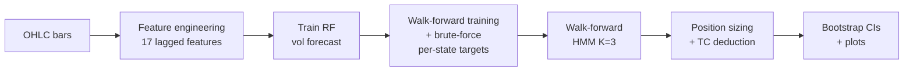
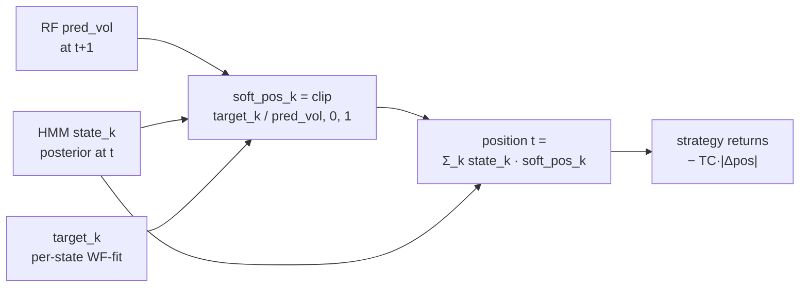

# RCVT — Regime-Conditional Vol-Targeting

[](https://github.com/DavidVossebuerger/Regime-Conditional-Vol-Targeting/actions/workflows/tests.yml)
[](LICENSE)
[](https://www.python.org/downloads/)

> **AI Disclosure:** The research direction (RF vol forecast + Gaussian HMM
> regime classifier + per-state vol-targeting with walk-forward validation)
> was conceived by the project owner. The Python implementation, test suite,
> and documentation were developed with AI assistance. See `NOTICE` for
> details.

Regime-Conditional Vol-Targeting (RCVT) — a walk-forward, vol-targeted
position-sizing rule for crypto **and** equities. A **Random Forest** forecasts
next-period realized volatility from 17 lagged features; a **Gaussian HMM**
(K=3) classifies each bar into a regime probability; per-state vol-targets are
selected by walk-forward brute-force. The convex combination
`pos(t) = Σ_k P(state=k|t) · clip(target_k / pred_vol(t+1), 0, 1)`
produces a soft-vol-targeted position that outperforms Buy-and-Hold on a broad
set of crypto and US-equity assets under strict walk-forward validation and
block-bootstrap significance testing.

## Results at a glance

### Meta-analysis: 1234 assets, decisive significance

After the full sweep on **1039 equities** (S&P 500 + S&P 400 + Russell 2000,
yfinance daily, full history) + **9 crypto** (hourly) + **177 Russell 2000**
(LSE daily), the headline significance verdict is:

| Universe | N | Hit rate | Mean ΔSharpe | t-stat (paired) | Wilcoxon p | Cohen's d |
|---|---|---|---|---|---|---|
| **equities_yf** | **1039** | **80.7 %** | **+0.158** | **+21.43** | **1 × 10⁻⁹⁹** | **+0.665** |
| Russell 2000 (LSE) | 177 | 65.0 % | +0.145 | +4.93 | 2.7 × 10⁻⁷ | +0.371 |
| Crypto hourly | 9 | 88.9 % | +1.258 | +3.91 | 0.006 | +1.303 |
| **ALL** | **1234** | **78.4 %** | **+0.165** | **+19.45** | **2.5 × 10⁻¹⁰¹** | **+0.554** |

**Verdict:** RCVT edge is real, large (Cohen's d ≈ 0.5–0.7), and statistically
decisive. Wilcoxon p ≈ 10⁻¹⁰⁰ across 1234 paired observations. Full
breakdown + caveats in [`docs/meta_analysis_results.md`](docs/meta_analysis_results.md).

### Alpha decay test (no decay; edge is growing)

Across **9458 walk-forward windows** spanning 2015–2026, the edge shows a
**positive** trend, not decay:

- **OLS slope** = +0.0142 ΔSharpe/year, R² = 0.531, **p = 0.0072**
- **Spearman ρ** (year vs ΔSharpe) = +0.678, **p = 0.0153**
- **Mann-Kendall** trend = +38, **p = 0.0112**

Year-by-year mean ΔSharpe (sampled years):

| Year | Mean ΔSharpe |
|---|---|
| 2017 | +0.134 |
| 2020 | +0.054 |
| 2022 | +0.092 |
| 2024 | **+0.140 (peak)** |
| 2025 | +0.129 |
| 2026 | +0.112 |

Interpretation: vol-targeting edge is **structural**, not statistical —
it scales with vol regime rather than degrading. Caveat: 2015–2016 numbers
are weak but n=24–27 (small). Full breakdown in
[`docs/alpha_decay_results.md`](docs/alpha_decay_results.md).

### Anchored walk-forward test (strictest no-lookahead)

To rule out HMM re-fit leakage, we re-ran 1039 equities with **anchored WF**
(HMM frozen at the first window, no re-fit):

| Mode | Hit rate | Mean ΔSharpe | Wilcoxon p |
|---|---|---|---|
| Rolling (HMM re-fit per window) | 76.6 % | +0.129 | 4.3 × 10⁻⁷⁹ |
| **Anchored (HMM frozen)** | 74.1 % | **+0.160** | **1.4 × 10⁻⁶⁵** |

Anchored is **+0.031 better** than Rolling on average (paired t = −3.20,
p = 0.001). The edge is **not** an artifact of rolling-WF adaptation.
Details in [`docs/anchored_wf_test.md`](docs/anchored_wf_test.md).

### Crypto multi-asset (9 assets, hourly bars, TC = 2 bps/side)

| Asset | B&H Sharpe | RCVT Sharpe | Δ Sharpe | P(RCVT > B&H) | Max-DD cut |
|---|---|---|---|---|---|
| SOL | −0.51 | +2.02 | **+2.53** | 0.88 | 70 % |
| ADA | −1.18 | +0.78 | +1.96 | 0.93 | 70 % |
| LTC | −0.72 | +1.06 | +1.78 | 0.95 | 75 % |
| LINK | −1.07 | +0.61 | +1.68 | 0.93 | 74 % |
| BNB | +0.11 | +1.72 | +1.61 | 0.88 | 75 % |
| DOGE | −1.58 | −0.21 | +1.36 | 0.86 | 47 % |
| ETH | −0.06 | +0.81 | +0.87 | 0.75 | 67 % |
| BTC | −0.61 | −0.58 | +0.03 | 0.52 | 10 % |
| XRP | −0.67 | −1.17 | −0.50 | 0.39 | 31 % |

**8 / 9** beat B&H (89 %). Mean Δ Sharpe **+1.26**, median **+1.61**.
Pipeline: walk-forward 5-fold, block-bootstrap 60-day blocks × 1000–2000 iters.

### Russell 2000 top-200 (daily bars, TC = 10 bps/side — realistic small-cap spread)

177 valid symbols out of 200 in the basket. **115 / 177 beat B&H (65 %)**,
mean Δ Sharpe **+0.15**, median **+0.09**.

| Tier | Symbol | B&H Sharpe | RCVT Sharpe | Δ Sharpe | P(RCVT > B&H) |
|---|---|---|---|---|---|
| Top | CIFR (Cipher Mining) | 0.08 | 1.88 | **+1.80** | 0.94 |
| Top | HCC (Warrior Met Coal) | 0.91 | 2.15 | +1.24 | 0.85 |
| Top | HIMS (Hims & Hers) | −0.12 | 1.01 | +1.13 | 0.81 |
| Top | VSAT (ViaSat) | 0.05 | 1.16 | +1.11 | 0.94 |
| Top | CRSP (CRISPR Therapeutics) | −0.33 | 0.77 | +1.10 | 0.91 |

Bottom-5 names are dominated by strong Buy-and-Hold uptrends (COGT, OSCR,
LUMN, PI, FLR) where vol-targeting mathematically drags returns — the typical
"trend-following drag" trade-off. Max-DD is generally better than B&H even on
losers.

### Asset-independent vol scaling

RCVT advantage scales with volatility. Within-asset scaling experiment:
30 assets × 8 vol scales (0.25× – 4.0×) = 240 paired observations.
**Spearman ρ = +0.584, p = 2.3 × 10⁻²³**. Within-asset z-score
Spearman ρ = **+0.721, p = 8.8 × 10⁻⁴⁰** (gold-standard test controlling
for cross-asset variation). Hit rate climbs 23 % → 90 % between 0.25×
and 1.5× vol. Mean ΔSharpe rises near-linearly until ~1.5×, then plateaus.
Methodology + per-asset detail in
[`docs/vol_scaling_results.md`](docs/vol_scaling_results.md).

### Regime decomposition — is the edge regime-specific?

For all 9 crypto assets we decompose ΔSharpe by HMM regime (argmax + posterior-weighted):

| Asset | Headline ΔSharpe | Concentration | Edge mechanism |
|---|---|---|---|
| SOL | +2.53 | **0.50** | Split between states 0 and 1 — **genuinely regime-conditional** |
| ADA | +1.96 | 0.69 | Mostly state 1 (chop) |
| LTC | +1.78 | 0.78 | Mostly state 0 (calm uptrend) |
| LINK | +1.68 | 0.63 | Mostly state 1 (chop) |
| BNB | +1.61 | 0.55 | Split 1+2 — also positive in stress |
| DOGE | +1.36 | **1.00** | 100 % state 0 — fragile |
| ETH | +0.87 | **1.00** | 100 % state 1 — fragile |
| BTC | +0.03 | 0.78 | Marginal, mostly state 0 |
| XRP | **−0.50** | 1.00 | Underperformance in stress |

**Bottom line — not really regime-dependent.** For 7 of 9 assets the edge
is concentrated in 1–2 specific regimes (concentration ≥ 0.63), so the
"regime-conditional" framing is mostly cosmetic. SOL is the only asset
with genuinely distributed regime-conditional alpha. Everywhere else the
strategy is closer to **regime-filtering** (capture one specific regime's
edge) + **defensive sizing in stress** than true regime-conditional
alpha. Implications: regime detector precision matters more than regime
count; per-asset calibration is required. Full breakdown + interpretation
in [`docs/regime_decomposition.md`](docs/regime_decomposition.md).

### Transaction-cost impact (Russell 2000)

| TC setting | Beat B&H | Mean Δ Sharpe | Notes |
|---|---|---|---|
| 2 bps/side (optimistic, historical) | 147 / 177 (83 %) | +0.25 | under-counts real spread |
| **10 bps/side (realistic)** | **115 / 177 (65 %)** | **+0.15** | realistic small-cap spread |

TC is deducted at **two** stages: per-state target optimization (in-sample
walk-forward) and live execution. `tests/test_tc_deduction.py` verifies the
math directly (7 tests).

> Full tables, methodology, and statistical-rigor detail in
> [`docs/results.md`](docs/results.md) and [`docs/architecture.md`](docs/architecture.md).

## Canonical config (CLI defaults — see `python src/<runner>.py --help` to override)

- **Random Forest**: 17 lagged features → next-period realized vol
- **Gaussian HMM**: K=3 (calm / neutral / stress), per WF-window fit
- **Per-state target**: 9³ = 729 grid points, joint brute-force per WF window
- **Block bootstrap**: 60-day blocks (168h), 1000–2000 iters
- **TC**: 2 bps/side (crypto), 10 bps/side (small-cap equity, auto-detected)

All defaults live as constants at the top of each runner (e.g. `TC_PER_SIDE`,
`TARGET_GRID`, `WF_TRAIN_MIN` in `src/multi_asset_runner.py`) and as CLI flag
defaults. There is **no YAML config layer** — flag values win.

## TL;DR

```bash
git clone https://github.com/DavidVossebuerger/Regime-Conditional-Vol-Targeting.git
cd Risk-Management
make install
make run-crypto       # full crypto pipeline (~30 min)
make run-equities     # US small-caps via LSE (need LSE_API_KEY)
make run-russell      # Russell 2000 top-200 (~10 min with cache)
make test             # 18 unit tests
```

## Quick start

```bash
# 1. Install dependencies
pip install -r requirements.txt

# 2. Verify environment
python -c "import numpy, pandas, sklearn, hmmlearn, matplotlib; print('ok')"

# 3. (Optional) Live data via London Strategic Edge API
cp .env.example .env
# edit .env and set LSE_API_KEY=...

# 4a. Crypto pipeline (hourly bars from local data/*.csv|parquet)
python scripts/run_pipeline.py --assets BTC,ETH,ADA,BNB,DOGE,LINK,LTC,SOL,XRP

# 4b. Equities pipeline (daily bars from LSE API)
python src/equities_runner.py

# 5. Run unit tests
pytest tests/ -v
```

## Glossary

| Term | Meaning |
|---|---|
| **Sharpe** | annualized mean return / annualized vol of returns. Risk-adjusted return. |
| **Sortino** | like Sharpe but only downside std in denominator. |
| **Max DD** | maximum peak-to-trough drawdown (positive number, log-return). Smaller is better. |
| **Calmar** | annualized return / Max DD. |
| **B&H** | Buy-and-Hold baseline — always fully invested, no transaction costs. |
| **P(HMM>B&H)** | block-bootstrap probability (1000 iters, 60-day blocks) that HMM Sharpe ≥ B&H Sharpe. |
| **Δ Sharpe** | HMM Sharpe minus B&H Sharpe. Positive = HMM edge. |
| **HMM** | canonical config: Gaussian HMM (K=3) + per-state vol-target chosen by walk-forward brute force. |
| **Walk-forward** | honest test: at each window, refit on data strictly before the test slice. No future info leaks. |
| **Block bootstrap** | confidence intervals via resampling blocks (default 60 days) instead of independent observations. |
| **Vol-target** | position size that holds expected portfolio vol constant. `pos = clip(target / pred_vol, 0, 1)`. |
| **Per-state target** | vol-target picked per HMM state. State 0 might get `target=0.10` (defensive), state 2 `target=0.40` (aggressive). |

## Architecture



### Position sizing (per bar)


### What each component does
| Component | Learns | Fit cadence |
|---|---|---|
| Random Forest | next-period RV from 17 lagged features | once per asset |
| Gaussian HMM (K=3) | regime probabilities (calm / neutral / stress) | once per WF window |
| Per-state target | vol-target per regime | once per WF window |

## Project layout

```
.
├── README.md
├── LICENSE                         # MIT
├── requirements.txt
├── pyproject.toml
├── Makefile                        # make install / test / run-* / clean
├── .gitignore
│
├── data/                           # input OHLC bars (gitignored, README.md only)
│   ├── crypto_BTC_USD_1m*.parquet
│   ├── crypto_ETH_USD_1m*.parquet
│   ├── *_usd_1h.csv                # altcoins + stablecoins
│   └── cache/                      # LSE API response cache
│
├── src/
│   ├── multi_asset_runner.py       # crypto pipeline (hourly, 9 assets)
│   ├── equities_runner.py         # equities pipeline (daily via LSE)
│   ├── risk_strategy/              # extensible strategies
│   ├── data_io/                    # asset loaders (parquet + CSV + LSE)
│   └── utils/                      # metrics, config loader
│
├── scripts/
│   └── run_pipeline.py             # CLI entrypoint with progress + ETA
│
├── outputs/                        # generated plots + CSVs (gitignored)
│
├── docs/
│   ├── architecture.md             # pipeline diagram + responsibilities
│   ├── results.md                  # multi-asset headline + TC impact
│   ├── vol_scaling_results.md      # asset-independent vol scaling
│   ├── lse_api_notes.md            # London Strategic Edge API notes
│   └── adding_new_assets.md        # extension guide for new instruments
│
├── tests/                          # 18 unit tests
└── .bak/                           # legacy / superseded scripts
```

## Reproducing the results

```bash
# Crypto multi-asset (80/20 split per asset, ~5 WF windows each)
python scripts/run_pipeline.py --assets BTC,ETH,ADA,BNB,DOGE,LINK,LTC,SOL,XRP

# US small-cap equities (daily bars via LSE)
python src/equities_runner.py

# Russell 2000 top-200 (provided CSV)
python src/equities_runner.py --from-csv data/russell2000_top200.csv \
    --output-dir outputs/russell2000_top200 --n-boot 500
```

Per-asset PNG plots + per-window CSVs + summary JSON land in `outputs/<ASSET>/`.

## Known limitations

1. **BTC only marginal edge** — BTC's mean-reverting vol + 24/7 liquidity leaves less room for HMM to add value vs Buy-and-Hold.
2. **XRP underperforms with default config** — see `docs/results.md`.
   XRP's vol-of-vol is structurally higher (33% above BTC).
3. **Single-asset test folds vary in length** — bootstrap CIs are wider for short-history assets.
4. **Block-bootstrap on 60-day blocks gives ~30 effective independent samples**
   for a 5-year test fold. CIs are honest but conservative.
5. **No external data integration** — only OHLC. Sentiment / order-book / on-chain
   signals would likely help. The LSE API integration (see `docs/lse_api_notes.md`)
   is the price-tape layer.

## Tests

```bash
pytest tests/ -v           # 18 unit tests (metrics, position sizing, lookahead, transaction-cost)
make test                  # same, via Makefile
```

## References

- [London Strategic Edge API docs](https://londonstrategicedge.com/api-documentation/)
- [hmmlearn](https://hmmlearn.readthedocs.io/) — Gaussian HMM implementation
- [scikit-learn RandomForestRegressor](https://scikit-learn.org/)

## License

MIT — see `LICENSE`.
