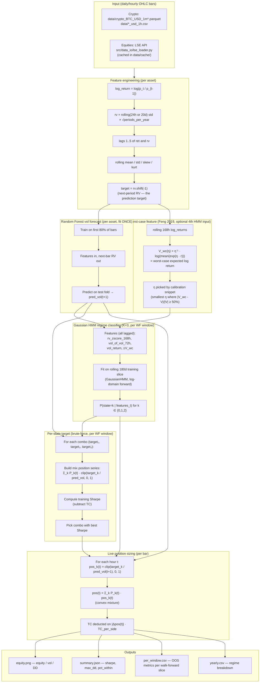
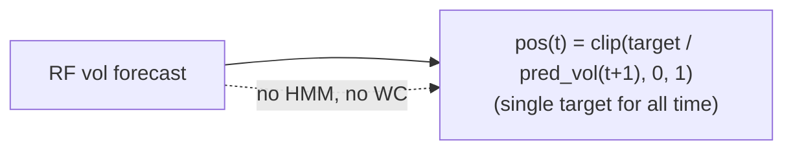

# Pipeline Architecture

End-to-end flow of the HMM wc-feat risk-management system. Each component has
a single responsibility; all data is shifted so no lookahead leaks.

## End-to-end flow



## Component responsibilities

| Component | Output | Fit cadence | What it learns |
|---|---|---|---|
| **Random Forest** | `pred_vol(t+1)` | once per asset | vol magnitude from lagged features |
| **Gaussian HMM** | `P(state=k | features_t)` | once per walk-forward window | regime probabilities (calm / neutral / stress) |
| **Per-state target** | `target_k ∈ {0.2..1.0}` | once per walk-forward window | risk-appetite per regime (joint brute-force over 11³ = 1331 combos) |
| **Worst-case feature** | `V_wc(t)` | recomputed each test bar | tail-risk magnitude from rolling 168h window |

## Key invariants

1. **No lookahead.** All features use `shift(+lag)` or rolling windows ending at time `t`.
   Only the *target* uses `shift(-1)`.
2. **Walk-forward honest.** Each test slice sees only HMMs/targets trained on data
   strictly before that slice.
3. **Convex mixture.** `Σ_k P_k(t) = 1` and `pos ∈ [0, 1]`, so position is bounded.
4. **Calibration snippet is in train fold only.** η is picked from a random 90-day
   slice of the train fold — never sees test data.
5. **Block bootstrap on 60-day blocks** (1 week for daily bars, 1 week for hourly).

## Where time is spent

```
Per asset, per run:
  LSE fetch (cold):     ~1s
  LSE fetch (cached):   ~0s
  RF fit (80% × 17 features):      ~0.3s
  HMM × N windows (K=3, log-domain): ~0.3s × N
  Per-state brute force (11³):     ~0.5s
  Bootstrap 500 × 60-day blocks:   ~0.5s
  ──────────────────────────────────
  Total per asset:     ~1-3s cold, ~0.5-1s warm
  200 assets:           ~5-15 min total
```

## Without HMM (static-soft fallback)



The static-soft config uses **one** `target_vol` for the entire history (picked
by in-sample Sharpe maximization on the calibration snippet). Used as the
`static_soft` baseline in every comparison; HMM wc-feat consistently beats it.
